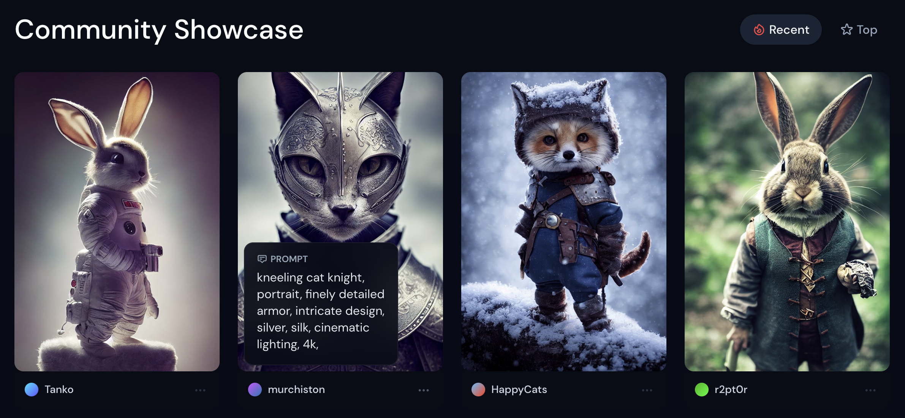

## A quick look at some amazing AI tools

There are some mindblowing AI tools out there that will quickly change the world... as a dev... you can build these things... or build on top of them... things like:

[drawing photorealistic images with simple brushstrokes](https://www.nvidia.com/en-us/studio/canvas/)

[having a conversation with AI](https://twitter.com/eigenrobot/status/1284042570507542528/photo/1)

[generating artwork from text](https://www.midjourney.com/showcase/)

### OpenAI

[the og](https://openai.com/) has been around for 5 years or so. Mostly closed source & pay for use

### Midjourney

[newer & has a free trial](https://www.midjourney.com/home/) the results [seem amazing](https://www.midjourney.com/showcase/)

### Stable Diffusion

[completely free & open source](https://huggingface.co/spaces/stabilityai/stable-diffusion) though it may not be as feature rich as the others. Definitely a good place to learn.

You can star their [repo on github](https://github.com/CompVis/stable-diffusion)
