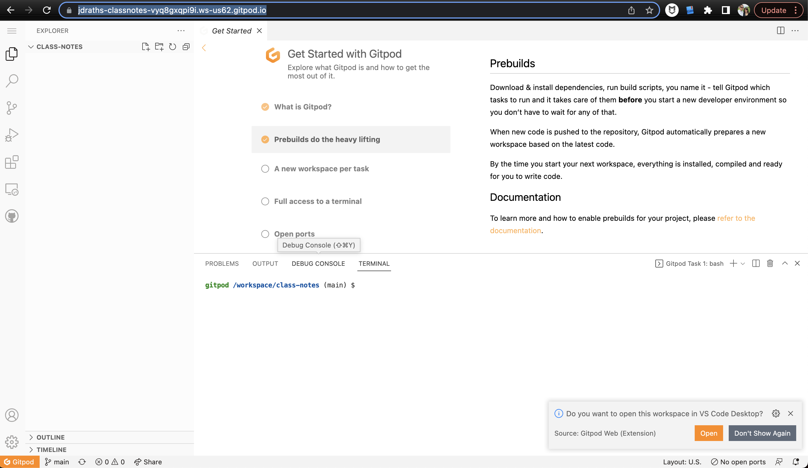
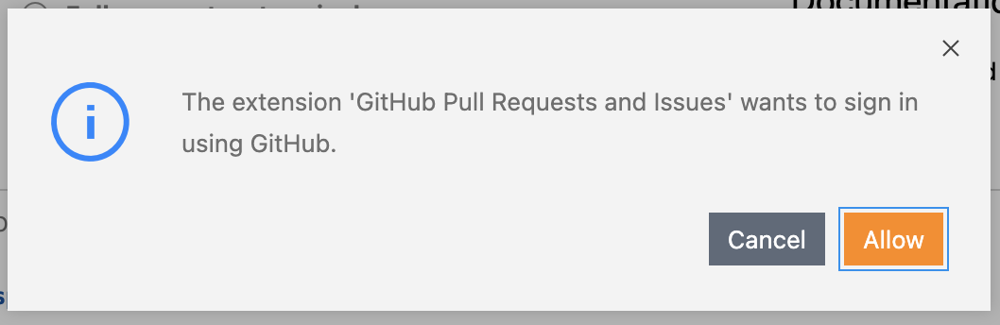
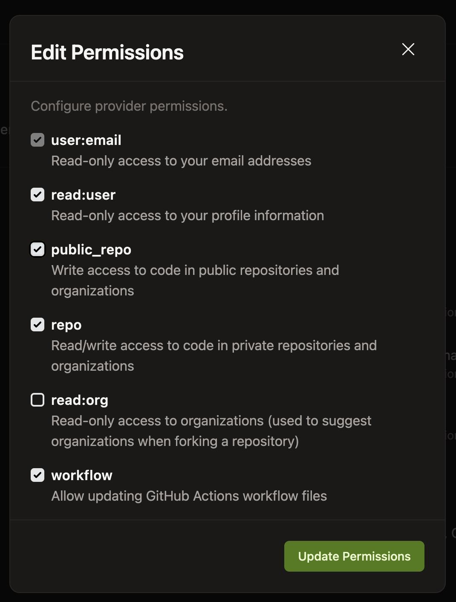
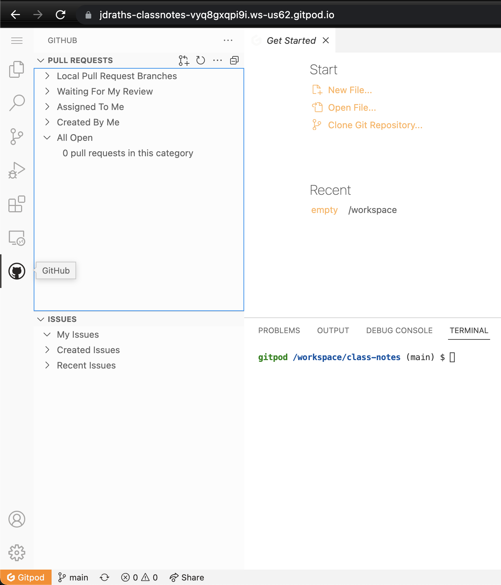

## What are we going to learn today

1. where to store our code (github)
2. how to edit our code (gitpod)
3. a little bit about the Terminal
4. nothing else needs to make sense today. In future classes we will circle back on all the confusing parts

## Let’s get set up

1. signup for github

    use your school email address

2. signup for gitpod

    “signup with github”

### go to github & create a new repo

1. at the top right click the plus sign & then `new repo`
2. fill the form
    * repository name: `class-notes`
    * then click `create repository`

### now open this repo in gitpod

1. navigate to: [https://gitpod.io/workspaces](https://gitpod.io/workspaces)
2. click `new workspace`
3. take the url of your github repo (something like [`https://github.com/jdraths/class-notes`](https://github.com/jdraths/class-notes)) & paste it in the form
4. press enter

> it might take a while to load, but you should be taken to a gitpod url like: [`https://jdraths-classnotes-vyq8gxqpi9i.ws-us62.gitpod.io/`](https://jdraths-classnotes-vyq8gxqpi9i.ws-us62.gitpod.io/)

fully loaded looks like this:


### ok, next, change your gitpod to dark mode

1. Click the settings wheel at the bottom left & then click `Color Theme`
    * choose any of the dark themes

    

2. Congrats, you’re a hacker now

---

## Let’s build a blog

### first something about Terminal

1. `pwd`
2. `ls`

### Ok, let's get create our blog via the Terminal

```sh
npx gatsby new class-notes https://github.com/gatsbyjs/gatsby-starter-blog
```

### A directory mishap we need to fix

1. class-notes is the name of your gatsby blog…
    * … but it’s also the name of our current directory… remember `pwd`

2. once install is complete…
    * `ls` again… now what
    * we have `class-notes` inside of `class-notes`

### fixing our directory mishap

```sh
$ cd class-notes
$ pwd
# ⇒ /workspace/class-notes/class-notes
```

* see?

#### so we need to move everything in the second class-notes into the 1st class-notes… this is just something annoying about gatsby & gitpod not working well together…

1. so, first cd back up one directory ⇒ `cd ..`
    * `pwd` to see where you are… it should be `/workspace/class-notes`
    * and if you `ls` then `class-notes` should be the child folder…
2. `mv class-notes/* .`
    * this means move everything in the `class-notes` child into the current directory (`.` means current directory, `*` means wildcard, aka everything)
3. now `mv class-notes/.* .`  (notice the extra period this time)
    * this command moves hidden files… don’t worry about why yet.
4. now `ls -a class-notes` to see if anything is still in the child (the `-a` means all files including hidden files…)
    * as long as it’s empty then ⇒ `rm -rf class-notes` to delete it

ok, now we have one `class-notes` folder without a child `class-notes`. We’re cooking!

#### Let’s push our code up to github so that we save our progress

* if you see this in Source Control… that’s wrong… refresh your screen; I think we confused gitpod with the duplicate `class-notes` folders


commit & push (via the Source Control UI)

#### Go check out your github profile

it's something like: [https://github.com/jdraths](https://github.com/jdraths)

*omg we have code on github…*

***omg our github profile shows some green boxes!***

---

### Ok, let’s run our blog locally

1. open `package.json` for a little familiarity
    * look at `scripts` & `start`
    * (this is typical for react apps) - You’ll learn more about this later

    for all the objects in `scripts` you can run `npm run [whatever]`... so rn, run `npm run start`

#### NICE, now let’s start editing

1. in our preview you can see we have three blog posts already generated for us

    

^^^ New Beginnings, My Second Post! & Hello World… let’s change these

1. navigate to `content` folder

    

2. let’s go to hello-world & change the file
    * “My Name is _____”
    * save & flip back to your other tab:

        

---

## Other things we might need

### connect github to gitpod… why isn’t this done automatically? 😭

1. click the github icon in the left nav (it’s a cat icon)
2. then click `Sign In`
3. you’ll get this warning next… click `Allow`

    

4. you’ll get this warning next (this time in bottom right)… click `Open Access Control`

    

5. it should open a new browser tab, here: [`https://gitpod.io/integrations`](https://gitpod.io/integrations) (if not, just click this link)
6. scroll down to Git Providers & click `Edit Permissions` on the Github line
    * you need to add the permissions listed in the above error message (`read:user`, `repo`, `workflow`)… also go ahead & toggle `public_repo`. 
    * When you’re done it will look like this: 

        

    * click `update permissions`
    * in the next window click `Authorize gitpod`
    * now close the [`https://gitpod.io/integrations`](https://gitpod.io/integrations) tab

7. navigate back to your gitpod workspace… it’s probably open in one of your browser tabs, but if not go find it here: [`https://gitpod.io/workspaces`](https://gitpod.io/workspaces)
    * it will be the workspace called `class-notes`

        

8. ok, back in your gitpod workspace, click the github logo (the cat)
    * after clicking the logo the left nav should look like this… if so, good. if not lmk.

    

### other changes that should be made on your own or in future classes

1. update gatsby-config attributes for `siteMetadata`, `gatsby-plugin-feed`'s `title`, & `gatsby-plugin-manifest`
2. update the favicon... need to google how to do this
3. update `Seo title=`
4. add a createPost script - that should be it's own blog post explaining this
5. add an about me page
6. styling changes... [we have a post for this](../blog-styling/)
7. add emoji support... need to google this
