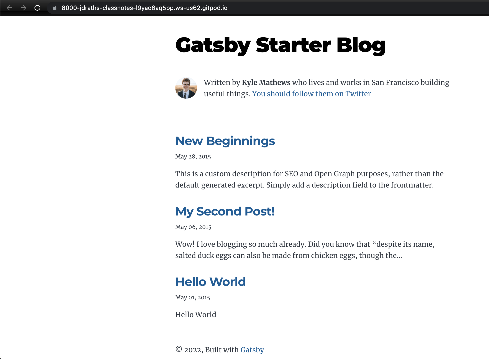
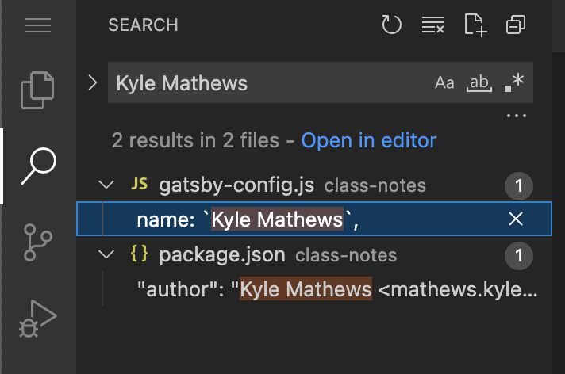

## Last week

In [Class 3](../class-3/) we pushed all of our gitpod changes to github & we ran our site locally for the first time `npm run start`.

This week we'll make the website our own.

### First, run the site again

```sh
npm run start
```

if you get an error... READ the error & see if you can determine what's wrong.

> It's probably that you're in the wrong directory. If you remember Gatsby created NESTED directories when we created our blog. This is an annoying side affect of Gatsby that we will eventually fix, but for now, it's a good reminder that your `npm run` commands have to run in directories that have `package.json`

In your case you need to run:

```sh
cd class-notes
```

Then you can run `npm run start`

### NICE, now let’s start editing

In our preview you can see we have three blog posts already generated for us



^^^ New Beginnings, My Second Post! & Hello World… let’s change these

navigate to `content` folder


let’s go to hello-world & change the file

* “My Name is _____”
* save & flip back to your other tab:


### What else can you do?

#### Go change this header


You're not Kyle Mathews & you don't live and work in San Francisco!

How would I change this?
I would start by searching for `Kyle Mathews` in my Gitpod Code Editor.

Search is the second icon on the left:


Nice, a couple results (only if you spelled it correctly...):


Ok, ignore the result in `package.json` right now & click the 1st result in `gatsby-config.js`

Change the `name` field in `gatsby-config.js` then look at your running browser preview.