## Last Week

Last week we:

1. created a [github](https://github.com) account
2. created a [gitpod](https://gitpod.io) account
3. generated a gatsby blog template with the command `npx gatsby ...`

Remember, github is for ***hosting*** your code. Gitpod is for ***editing*** your code. After you edit your code on gitpod you need to push the changes to github in order to save them.

## Today

1. sign back in to [gitpod](https://gitpod.io/workspaces)
2. 

## Let's go

### Sign In to Gitpod

Use your github login
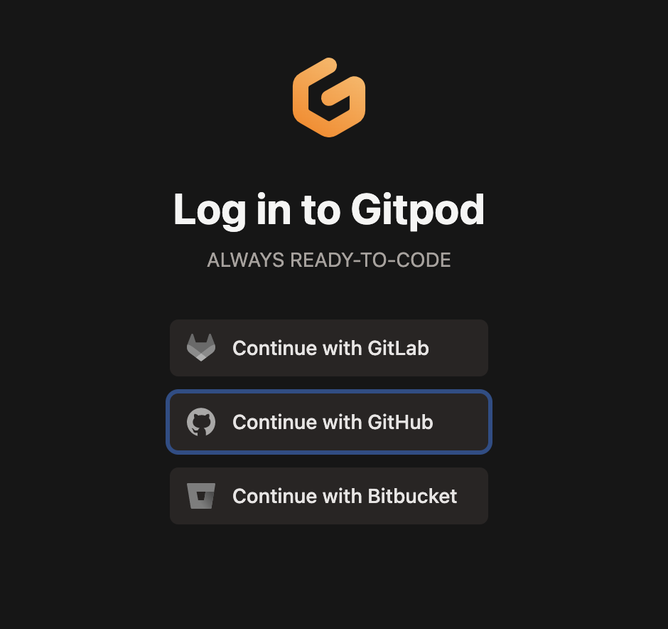

If you're not signed in to github already then you'll get a pop up. Sign in to github.
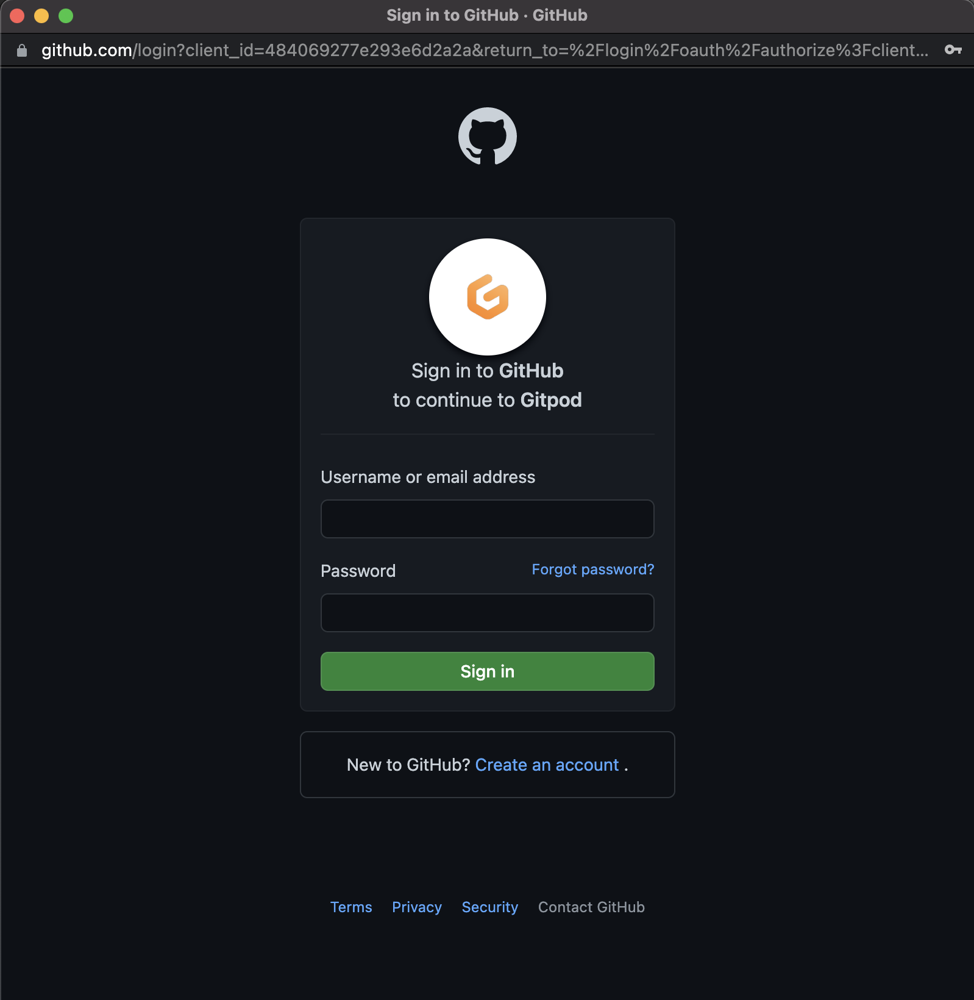

(If you can't remember you password reset it in the popup).

### Navigate to your gitpod workspace

After login gitpod should have taken you here [https://gitpod.io/workspaces](https://gitpod.io/workspaces). If not, navigate there directly.
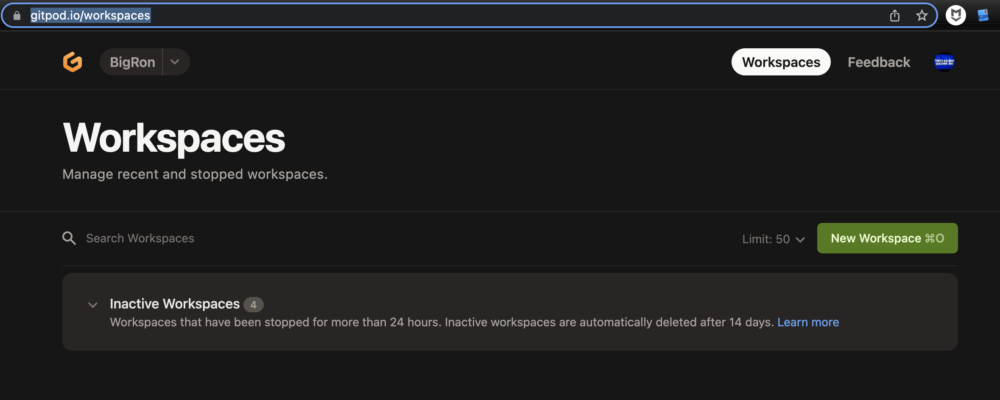

Click on "Inactive Workspaces".

You should have one inactive workspace called something like "Class-Notes". This is the workspace we created last week.

You'll notice in the 4th column it will say you have `28 changes`. These are the changes that were auto-generated by the `npx gatsby new class-notes https://github.com/gatsbyjs/gatsby-starter-blog` command last week.
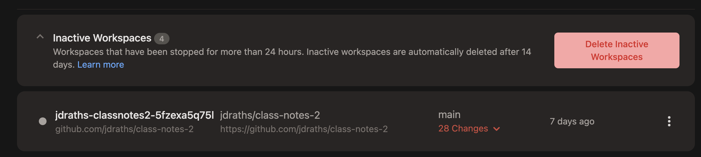

> ***IMPORTANT:***
> Normally we would not leave `changes` in our gitpod.
> Gitpod deletes workspaces automatically, any changes left in your workspace will also get deleted.
> Normally you would `push` your changes from gitpod to github every day, but last week we ran out of time.

So to fix this bad practice we are going to push our current changes, right now.

### Push your current changes from gitpod to github

First we need to open last week's workspace.

Click the `kebob` (yea that's what it's called) on the far-right side of your workspace & then click `Open`.
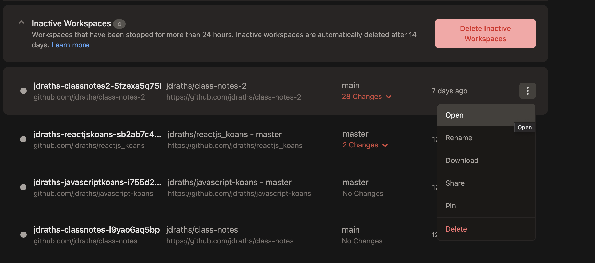

Once your workspace (it might take a minute) is loaded you should see this:

> btw, sometimes my workspace loads incorrectly & looks jumbled. refresh your browser window to fix that

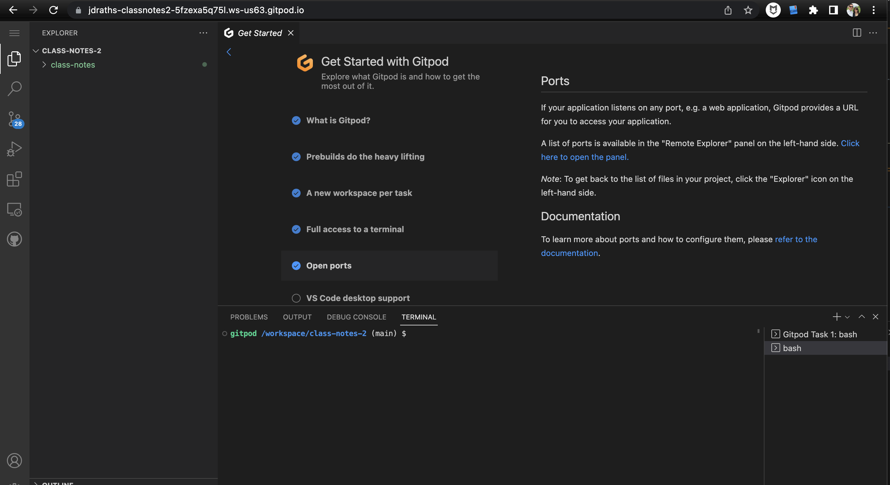

Ok, we need to push our 28 staged changes. In the left-nav of your workspace you'll see an icon showing you there are 28 changes.
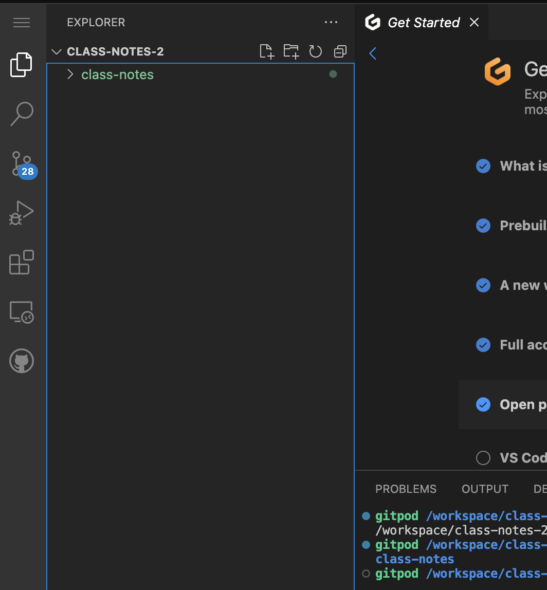

click that ^^^ icon & you'll see this:
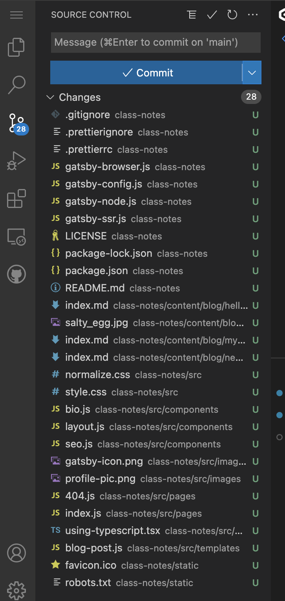

This section of your left-nav is called ***Source Control***. We'll learn more about it later, but some things are already obvious:

> `Source Control` tracks your changes that have not yet been `commited`

There is a ton of nuance in what that means. We'll learn that nuance later.

For now, let's `commit` those `staged changes`.

Click the down-caret to the right of `Commit` & then click `Commit and create pull request`
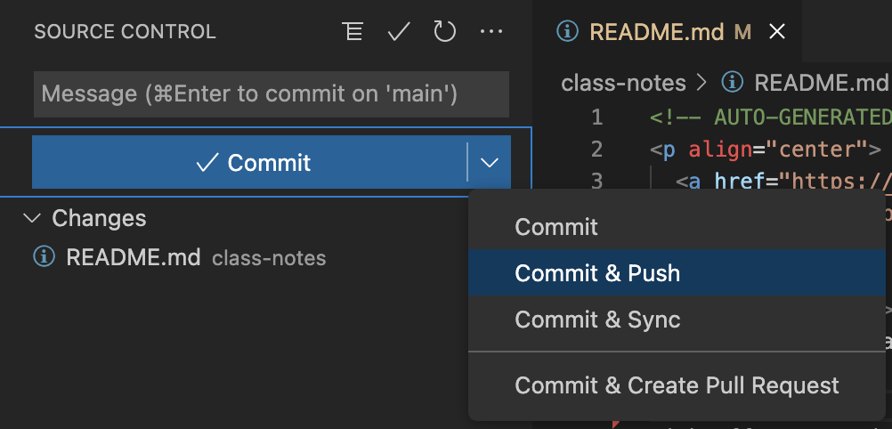

Oh shoot I forgot something:
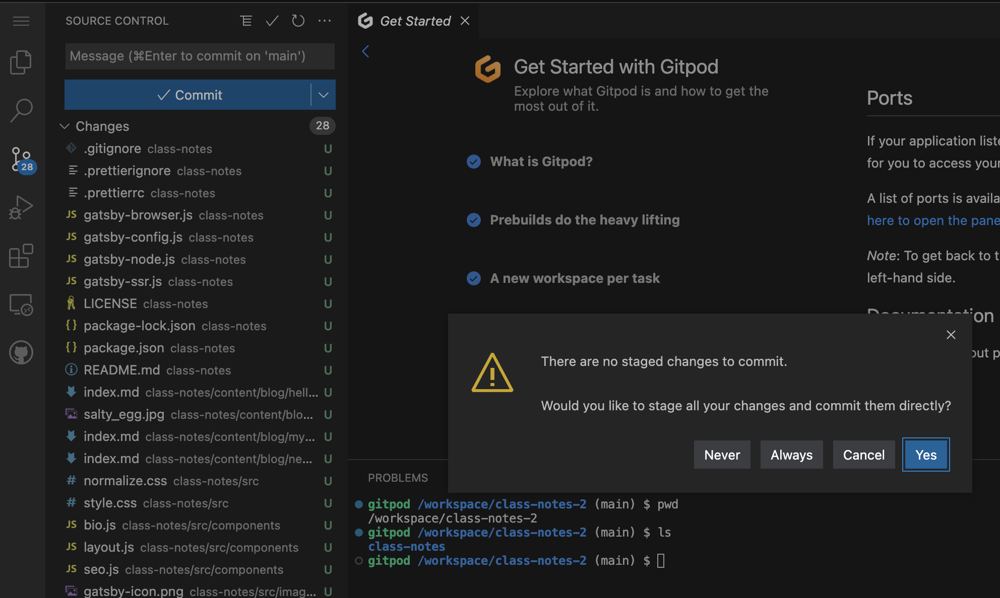

For now, just click `yes`. We'll explain later.

An editor window will pop-up. This is where you'll enter a `commit message`
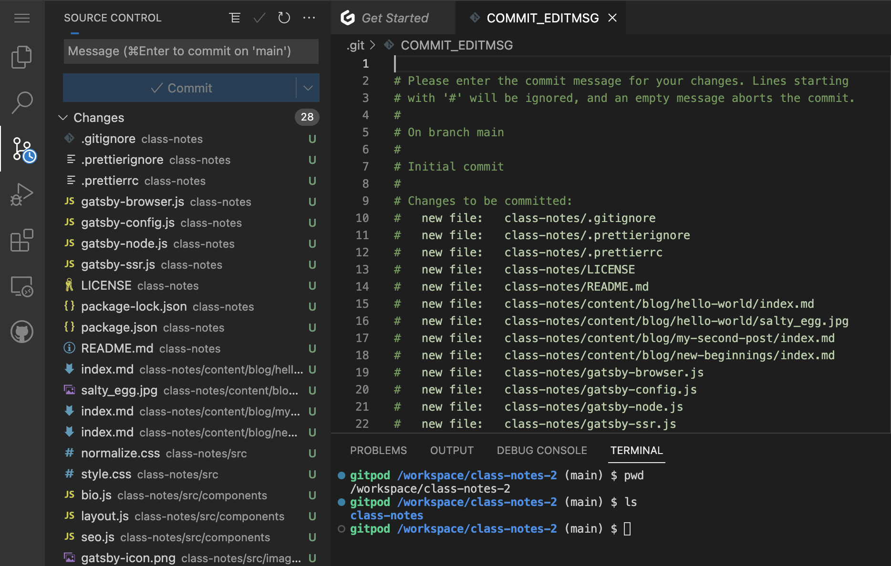

> It's important to enter a descriptive commit message. Your future self will thank you.

So enter your commit message (leave all the green text):
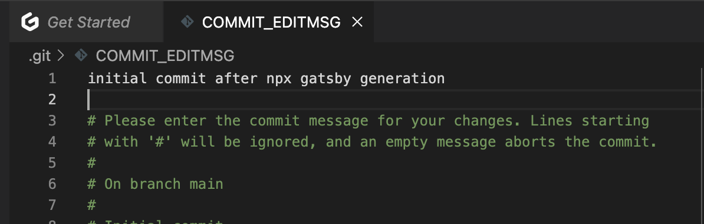

Then close that editor window (click the little x):
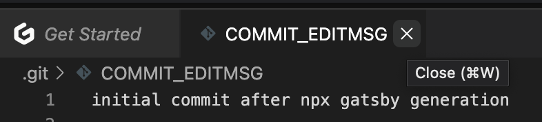

> I have a feeling I forgot something about permissions here... But I recorded permission issues [here](../gitpod-github-permissions)

#### Go check out your github profile

it's something like: [https://github.com/jdraths](https://github.com/jdraths)

*omg we have code on github…*

***omg our github profile shows some green boxes!***
