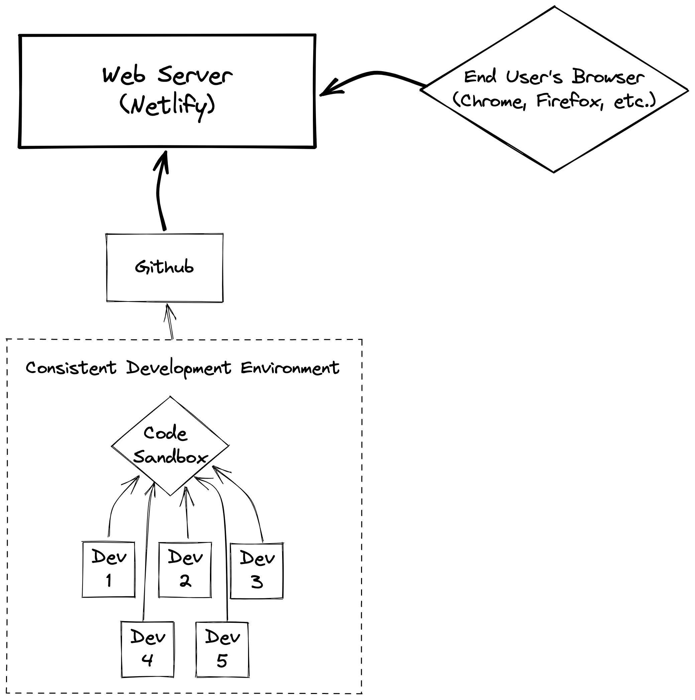

## Code Sandbox will replace Gitpod

Last week we were rugged by Gitpod... so... now we're going to use Code Sandbox, which is a good alternative.

### Signin with your Github Account

Sign In [here](https://codesandbox.io/signin)

### Join my Altus Academy team

Join the Team [here](https://codesandbox.io/invite/uw8sghrhcbzlj9wl)

## Why are we using Code Sandbox or Gitpod anyways?

<!--  -->

## After this continue with Class 3 part 2

[Class 3 Part 2 - Getting your website running](../class-3-part-2/)

