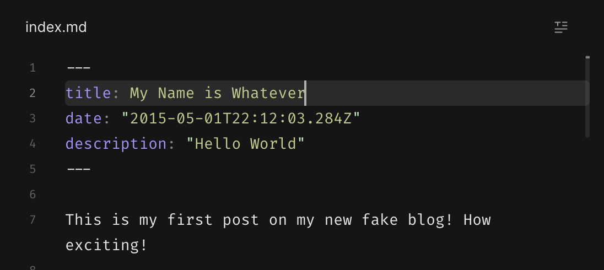

## Last Week

1. We got setup in CodeSandbox
2. We found the "Hello World" posts in our class-notes repos...

## This Week

1. Let's edit the "Hello World" post
2. Let's push our edits to Github
3. Let's get a solid workflow going. This is amazing.

## Edit the Hello World Post

First things first, search for "Hello World" in Code Sandbox.
Code Sandbox's search tab will return all results in your code where the string "Hello World" appears. IMO that's the fastest way to find pieces that you want to change & anytime I see something on my website that I don't like... I search for it.

### Remember if your sandbox doesn't show up... import it


### Search for Hello World

The search icon (it's on the top left)


Search Results... These results show there is (1) file named `index.md` that includes the string "Hello World" on (2) lines.


### Edit the Hello World file

If you click one of the lines the `index.md` file will open, BUT IT's NOT EDITABLE... annoying

You can make it editable by clicking on this weird little icon at the top right of the file `<>`


Now it's editable


Edit the text from "Hello World" to "My Name is Whatever"


### Run your website

Open a terminal


Do you remember how to start your server?


Oh no the directory error again


Fix it by changing into the correct directory
```sh
# remember you can start typing class & press tab to autocomplete it
cd class-notes
```

Then try `npm run start again`


Ahhh! `npm install` (you shouldn't always have to npm install when you start a new CodeSandbox ... maybe this is a nuance of CodeSandbox or something we're doing wrong)

You'll know `npm install` is working when you see this


It'll take a while... Here's a comic:


It's done when you see this, so then `npm run start again`


When `npm run start` is done you can open the website preview in the top of Code Sandbox's UI


Open the preview in full screen by clicking the little double window icon


### Edit -> Preview Workflow

So now we can see a preview of our website... anytime we make an edit this preview should AUTOMATICALLY update... so go make a bunch of edits


### And push your edits to github

Click this little icon on the top left


Then click `commit and push`

Then click `open pull request`


Then create the pull request in github


### Temperature Check

- We should talk about everything we just did.
- This is AMAZING progress.
