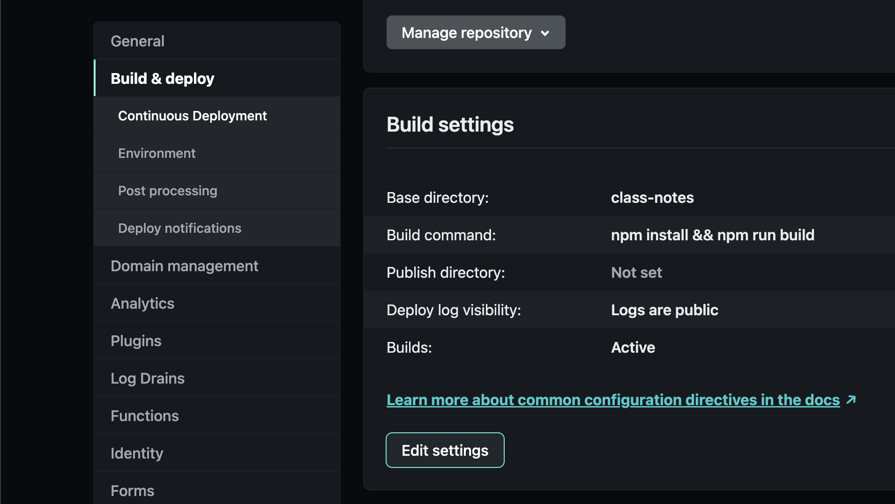
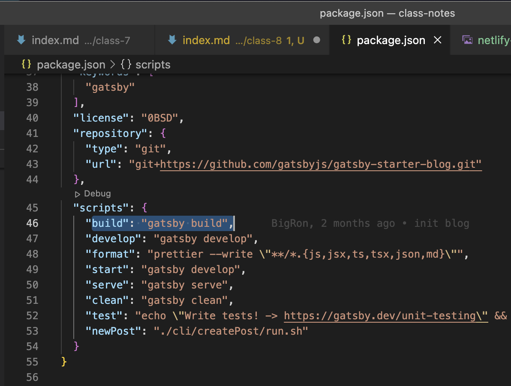
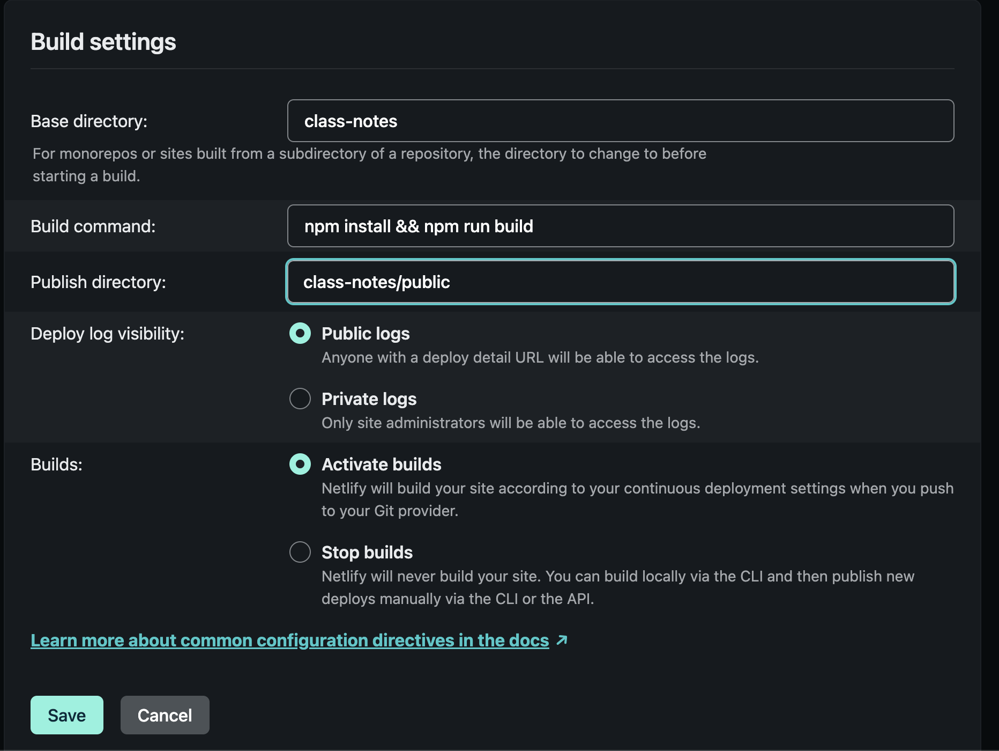
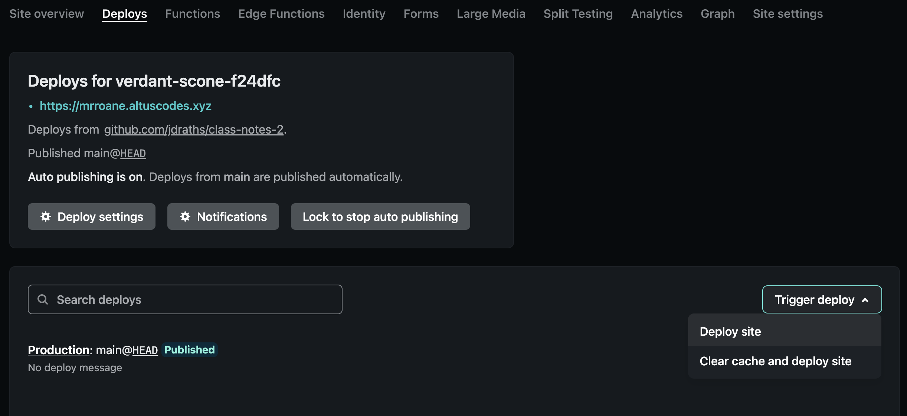
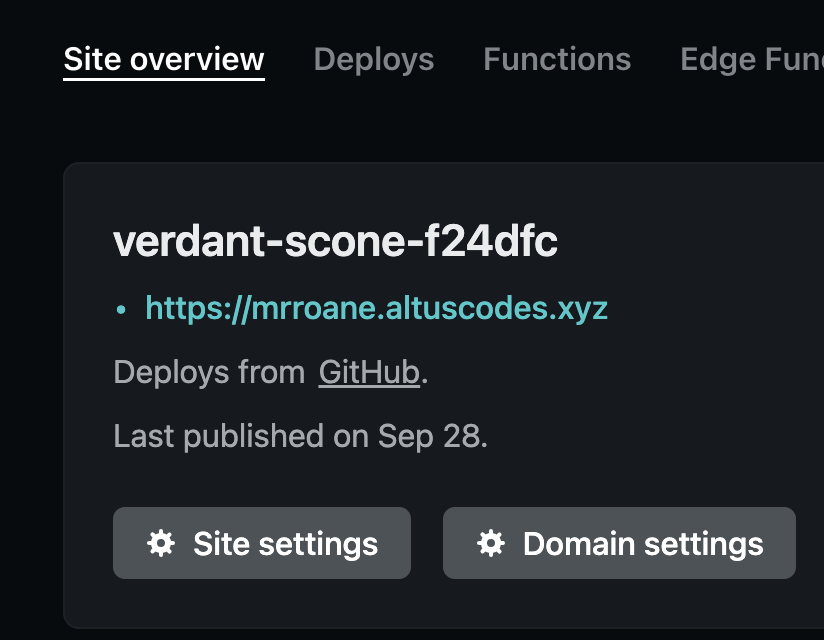
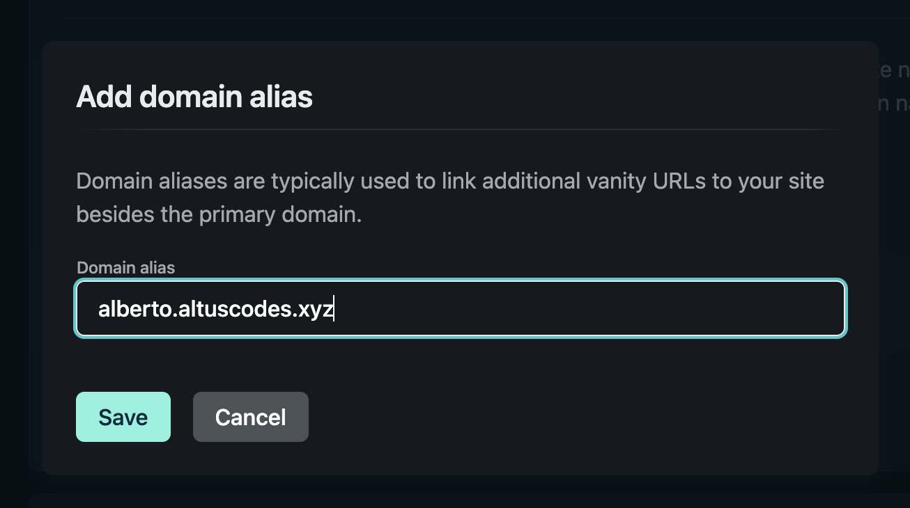

## Last Week

Ok, where did we get stuck? Two places I think:

1. our `base directory`, `build command`, and `publish directory` fields in Netlify didn't seem right
2. so then our builds were failing
3. we also were blocked on creating our own subdomains & attaching those to our netlify deployment

Let's take these issues 1 by 1 today

## 1. Netlify Build Settings

Last week we got to this point:


But our builds never succeeded.

I figured this out by going to `package.json` and checking our scripts. If I run `npm run build` I'll see a new `public` folder get created with our site content in it... this is our publish directory. It's a little confusing, but it will make more sense as we build more projects.


So with that new knowledge what should our `publish directory` be in Netlify?

```sh
class-notes/public
```

- `class-notes` because that's our `base directory` (where all our project files are kept in our repo).
- `public` because that's where `npm run build` output files to

OK, putting all that together:


## 2. rebuild your site

After saving your build settings in Netlify you need to go trigger a new build (or deploy). This is under the `Deploys` tab in the top nav of the Netlify site


## 3. fix our subdomains

For this we were blocked by a Netlify setting. Since my Netlify account controlled the `altuscodes.xyz` domain then your Netlify accounts weren't allowed to add subdomains like `ian.altuscodes.xyz`. So I fixed this by relocating `altuscodes.xyz` to a Netlify competitor, Fleek. Now you should all be able to create your own subdomains.

Let's do it.

### Edit your domain settings

This is in Netlify in the `Site Overview` tab:


Add domain alias:


### 4. You did it

🛳 <a href="https://alberto.altuscodes.xyz" target="_blank" rel="noreferrer">alberto.altuscodes.xyz</a>

🚀 <a href="https://alex.altuscodes.xyz" target="_blank" rel="noreferrer">alex.altuscodes.xyz</a>

🛳 <a href="https://brian.altuscodes.xyz" target="_blank" rel="noreferrer">brian.altuscodes.xyz</a>

🚀 <a href="https://dre.altuscodes.xyz" target="_blank" rel="noreferrer">dre.altuscodes.xyz</a>

🛳 <a href="https://gabriel.altuscodes.xyz" target="_blank" rel="noreferrer">gabriel.altuscodes.xyz</a>

🚀 <a href="https://gabrielm.altuscodes.xyz" target="_blank" rel="noreferrer">gabrielm.altuscodes.xyz</a>

🛳 <a href="https://isaiah.altuscodes.xyz" target="_blank" rel="noreferrer">isaiah.altuscodes.xyz</a>

🚀 <a href="https://joshua.altuscodes.xyz" target="_blank" rel="noreferrer">joshua.altuscodes.xyz</a>

🛳 <a href="https://marlon.altuscodes.xyz" target="_blank" rel="noreferrer">marlon.altuscodes.xyz</a>

🚀 <a href="https://max.altuscodes.xyz" target="_blank" rel="noreferrer">max.altuscodes.xyz</a>

🛳 <a href="https://steph.altuscodes.xyz" target="_blank" rel="noreferrer">steph.altuscodes.xyz</a>

🚀 <a href="https://zeus.altuscodes.xyz" target="_blank" rel="noreferrer">zeus.altuscodes.xyz</a>