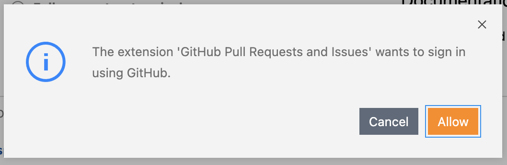
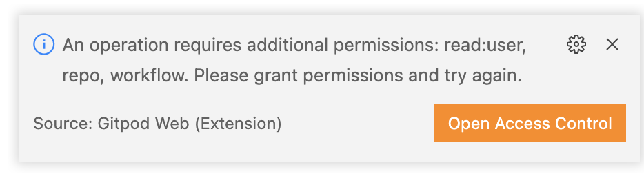
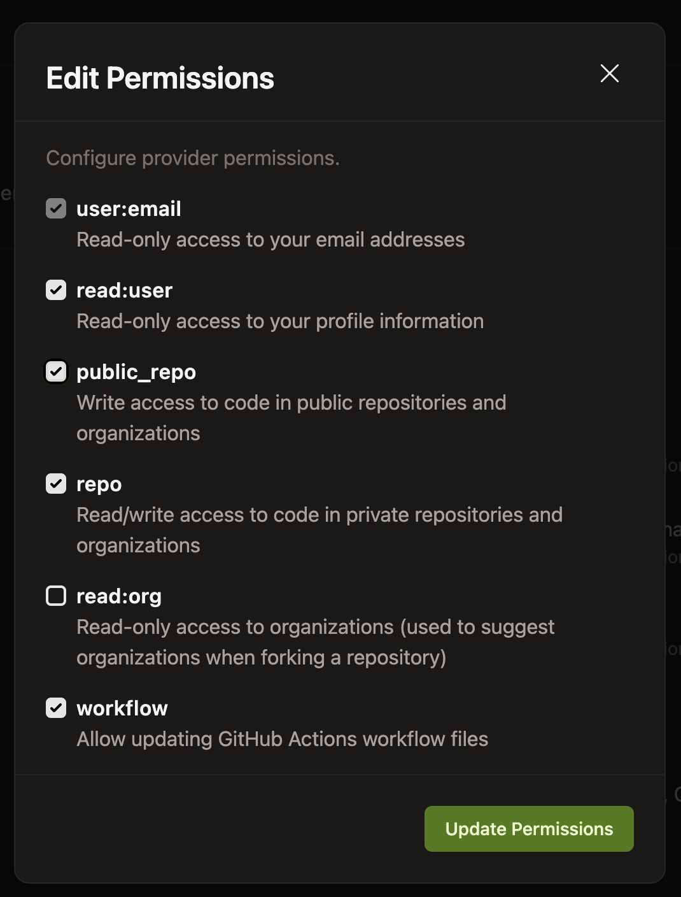
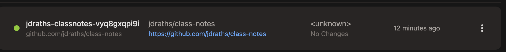
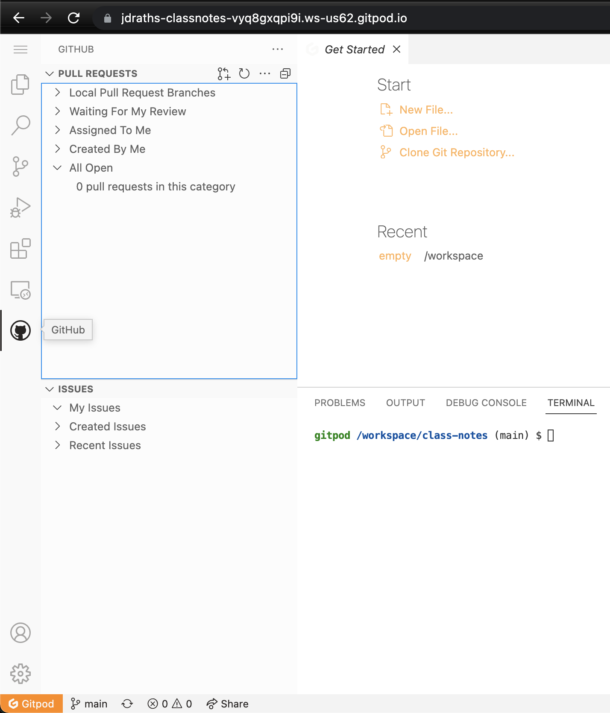

### connect github to gitpod… why isn’t this done automatically? 😭

1. click the github icon in the left nav (it’s a cat icon)
2. then click `Sign In`
3. you’ll get this warning next… click `Allow`

    

4. you’ll get this warning next (this time in bottom right)… click `Open Access Control`

    

5. it should open a new browser tab, here: [`https://gitpod.io/integrations`](https://gitpod.io/integrations) (if not, just click this link)
6. scroll down to Git Providers & click `Edit Permissions` on the Github line
    * you need to add the permissions listed in the above error message (`read:user`, `repo`, `workflow`)… also go ahead & toggle `public_repo`. 
    * When you’re done it will look like this: 

        

    * click `update permissions`
    * in the next window click `Authorize gitpod`
    * now close the [`https://gitpod.io/integrations`](https://gitpod.io/integrations) tab

7. navigate back to your gitpod workspace… it’s probably open in one of your browser tabs, but if not go find it here: [`https://gitpod.io/workspaces`](https://gitpod.io/workspaces)
    * it will be the workspace called `class-notes`

        

8. ok, back in your gitpod workspace, click the github logo (the cat)
    * after clicking the logo the left nav should look like this… if so, good. if not lmk.

    
